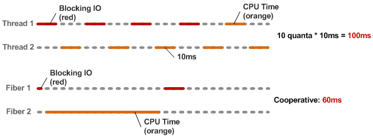

!SLIDE bullets incremental
# Threads vs Fibers #
## Ding! Ding! Round 2 ##
### Scheduling ###

!SLIDE bullets incremental
# Scheduling #
* Threads are scheduled in time slices
* Controlled by the Scheduler

!SLIDE bullets incremental
# Scheduling #
* Fibers are co-operatively scheduled
* Controlled by you!

!SLIDE
# Scheduling #

### Consider the example of 2 sections of code competing for CPU time.
### One takes 50ms of cpu time
### The other takes 40ms of blocking \*something\* and 10ms of cpu time

!SLIDE
# Scheduling #

### Run side by side these 2 sections of code would take 100ms in total ###
### If we can cooperatively schedule them, we can compress that into just 60ms ###

!SLIDE center
## Scheduling ##

http://www.igvita.com/2009/05/13/fibers-cooperative-scheduling-in-ruby/